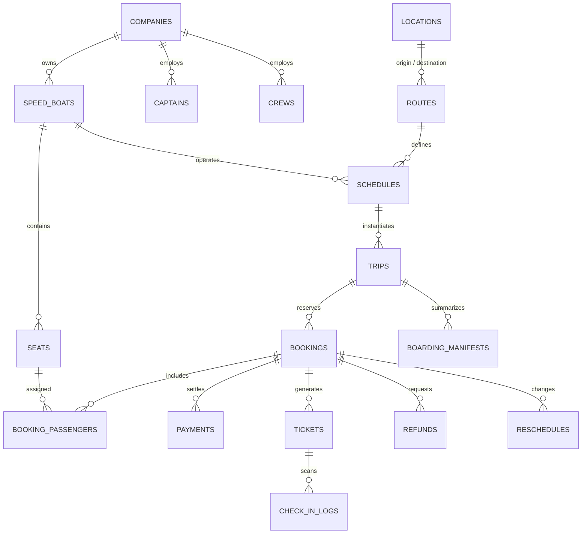
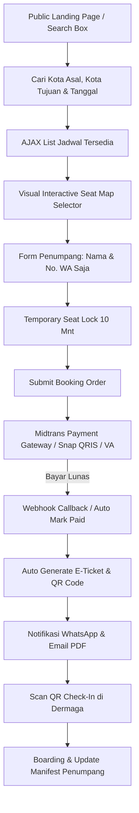
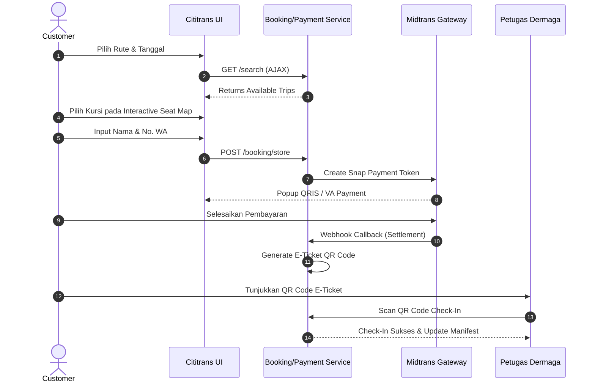

# DOKUMENTASI SISTEM PEMESANAN TIKET SPEED BOAT (CODEIGNITER 4 ENTERPRISE)

Aplikasi **Pemesanan Tiket Speed Boat** berbasis **CodeIgniter 4** ini dirancang dengan kualitas **Enterprise**, menggunakan **Clean Architecture** (Repository & Service Layer Pattern), UI modern terinspirasi oleh **Cititrans**, integrasi **Midtrans Payment Gateway**, e-ticket QR Code, scanner boarding, serta dashboard operasional AdminLTE 4.

---

## 1. ERD & Skema Database Normalisasi (3NF)

Database `speed_boat_db` mencakup 27 entitas utama yang saling terelasi secara konsisten:



---

## 2. Diagram Alur Sistem (Flowchart)



---

## 3. Diagram Arsitektur & UML

### A. Use Case Diagram
- **Member / Penumpang**: Cari Jadwal, Pilih Kursi, Input Nama & Kontak, Bayar via Midtrans, Download E-Ticket PDF, Request Refund/Reschedule.
- **Petugas Dermaga**: Scan QR Code Check-In, Validasi Boarding, Lihat Manifest Keberangkatan.
- **Kasir / Admin Ops**: Booking Offline, Kelola Jadwal, Armada, Rute, & Tarif.
- **Supervisor / Manajer**: Approval Refund, Monitoring Manifest, Lihat Laporan Penjualan & Grafik.
- **Super Admin**: Akses penuh RBAC & Sistem.

### B. Sequence Diagram (Booking & Check-In)



---

## 4. Panduan Instalasi & Deployment

### Persyaratan Server / Runtime:
- PHP >= 8.3 dengan ekstensi `mysqli`, `gd`, `zip`, `mbstring`, `openssl`, `curl`
- MySQL / MariaDB >= 8.0
- Composer v2.x

### Langkah Instalasi:
1. Clone / Salin proyek ke folder webserver (misal `c:\xampp\htdocs\speed`).
2. Buat database MySQL `speed_boat_db`.
3. Jalankan migrasi dan seeder awal:
   ```bash
   php spark migrate
   php spark db:seed DatabaseSeeder
   ```
4. Sesuaikan konfigurasi `.env` (Midtrans Server & Client Key).
5. Jalankan server pengujian:
   ```bash
   php spark serve
   ```
6. Akses aplikasi:
   - **Frontend Publik**: `http://localhost:8080/`
   - **Dashboard Admin**: `http://localhost:8080/login`
   - **Kredensial Login Admin**: `admin@speed.test` / `password123`
